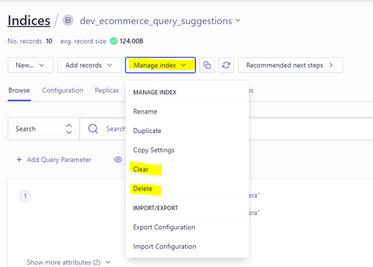

*Question 1*  

 
From: marissa@startup.com  
Subject:  Bad design  

Hello,  
  
Sorry to give you the kind of feedback that I know you do not want to hear, but I really hate the new dashboard design. Clearing and deleting indexes are now several clicks away. I am needing to use these features while iterating, so this is inconvenient.  
   
Thanks,  
Marissa  

From: cweiss@algolia.com
Subject: Bad design

Hi Marissa,

Thank you for this valuable feedback. I can take this back to our engineering team for further review.

For now, there are two ways to manage indicies. The first is in the dashboard. You can switch between indices with the drop-down menu at the top of the page by clicking on the index or searching for it:

 
Once you select the index you want to work with, click Manage Index just below the index name to Delete, Clear, and more:
 

The other way to manage indices is directly through our API Client. If you are looking to delete one or multiple indices, this solution might work well. I have linked the documentation to Delete Indices here: [Delete Indices with API Client](https://www.algolia.com/doc/guides/sending-and-managing-data/manage-your-indices/how-to/delete-multiple-indices/).

Please let me know if there is any other way that I can help. I am happy to set up a quick call to go over ways to make this process easier.

Thanks,

Cat Weiss

--

*Question 2*:   
  
From: carrie@coffee.com  
Subject: URGENT ISSUE WITH PRODUCTION!!!!  
  
Since today 9:15am we have been seeing a lot of errors on our website. Multiple users have reported that they were unable to publish their feedbacks and that an alert box with "Record is too big, please contact enterprise@algolia.com".  
  
Our website is an imdb like website where users can post reviews of coffee shops online. Along with that we enrich every record with a lot of metadata that is not for search. I am already a paying customer of your service, what else do you need to make your search work?  
  
Please advise on how to fix this. Thanks.   

From: cweiss@algolia.com  
Subject: URGENT ISSUE WITH PRODUCTION!!!!  

Hi Carrie,

Thanks for reaching out. We will get this resolved as quickly as possible. 

One of the easiest ways to reduce record size is to remove unused attributes. It sounds like there is a lot of metadata with each record that is not used in the context of search. Removing those attributes would free up space in the record. You can find documentation to help reduce record size at this link: [Reducing Record Size] (https://www.algolia.com/doc/guides/sending-and-managing-data/prepare-your-data/how-to/reducing-object-size/)

If this does not free up enough space, we could look into upgrading your plan. Algolia limits the size of a record for performance reasons based on your plan.

Please let me know if you have any further questions or would like to set up a call to discuss solutions. I know this is an urgent issue, and hopefully we can resolve it quickly.

Thanks,

Cat Weiss

--

*Question 3*:   

From: marc@hotmail.com  
Subject: Error on website  
  
Hi, my website is not working and here's the error:  
  
  
  
Can you fix it please?  

From: cweiss@algolia.com  
Subject: Error on website  

Hi Marc,

Thank you for reaching out. It looks like you are trying to use SearchKit in your index.js file before it has been defined. I would verify that the package has bee installed on your project and you are importing it correctly into index.js.

Please note that SearchKit is toolkit that is not maintained by Algolia. It may be best to reach out to the SearchKit team directly for any further questions. 

Please let me know if there is any way for me to be of further assistance.

Thanks,

Cat Weiss
